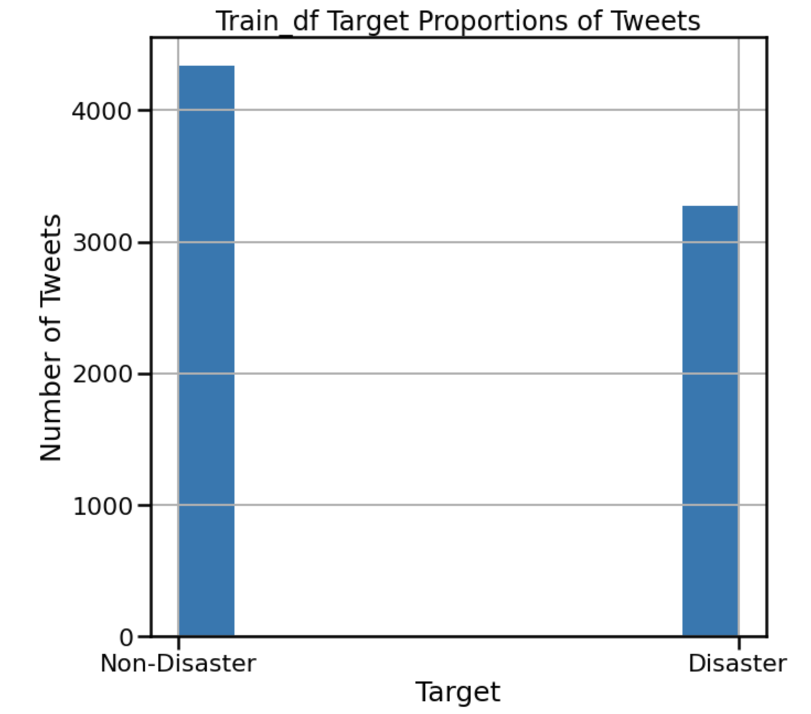

# Text Classification of Tweets: Are they about a real disaster or not?
(This project and data is sourced from the Kaggle Competition "Natural Language Processing with Disaster Tweets")

###### Project by Nicole Michaud, 12/30/2023

## Business Problem
Data has been accumulated from a number of tweets, some of which are about disasters, some of which are not. By creating a model for Natural Language Processing (NLP), we can predict whether or not a given tweet is about a real disaster or not. This can benefit companies who wish to monitor twitter in the event of an emergency.

## Data Understanding
To begin, I import all the neccessary tools I will need for this project as well as the dataset I will be working with. I also explore the dataset to get a better understanding of the data it contains.

The dataset 'train_df' contains 7,613 tweets, including their text, the location they were sent from, a keyword for each tweet, and the target-- which is 1 if the tweet is about a disaster and 0 if it is not.

The dataset 'test_df' contains 3,263 tweets with their text, location, and keyword.

I explored the 'keyword' feature in the Miscellaneous notebook, but ultimately decided to remove it as well as the 'location' feature, because they were not relevant to my project goal.

I created a histogram to view the proportion of the tweets in train_df that were about a disaster or not:

   
I also calculated the probability of a tweet in train_df being about a disaster or not. It was found that there is about a 43% chance that a tweet is about a disaster and about a 57% chance that it is not.

## Data Preparation
To begin preparing the data for modeling, I created a function to clean the tweet text by making the words all lowercase and removing stopwords, punctuation, symbols, numbers, links, and tags. Then, I applied this function to train_df and test_df and previewed them to ensure that this worked.

Next, I performed a train-test split on train_df the use when creating models to see how they performed before using them on the test data. I applied my cleaning function to this split data as well.

## Modeling

Using a pipeling, I created a baseline Multinomial Naive Bayes model that was vectorized using CountVectorizer. This model performed pretty well, with an average F1 score of about <b>79.91%</b>.

I proceeded to try different models including one that was TF-IDF Vectorized, one that included bigrams as well as single words, one with stemmed words, and one with lemmatized words. The model that performed the best so far was the stemmed model, with an F1 score of about <b>80.22%</b>.

To try and improve this model even more, I performed a GridSearch on the model parameters alpha and fit_prior. This determined the best value of alpha to be 2.0 and of fit_prior to be True. This means that of the options I provided the GridSearch with, the model will perform best with a smoothing parameter of 2 and class prior probabilities as opposed to a uniform prior probability.

With these tuned hyperparameters, the stemmed model performed very slightly better, but was still the best model so far with an F1 score of <b>80.23%</b>.

This model gave <b>943</b> <em>True Negatives</em>, <b>597</b> <em>True Positives</em>, <b>148</b> <em>False Positives</em>, and <b>216</b> <em>False Negatives</em>. In this case, both false positives and false negatives can be costly.

### Fitting best model on test data and generating predictions
Before creating predictions on the sample submission file, I wanted to try it on the test_df to make sure it works. 

It appeared to have worked, as test_df now had a 'target' column with predictions. In the test file, out of 3,263 tweets, the final model classified 1230 as being about a disaster and 2033 as not being about a disaster.

I generated my predictions onto the sample submission file. 

## Conclusion

### Recommendations:
- Model should be deployed to monitor twitter for disaster tweets

### Next Steps:
- Continue testing other models to see if performance can be improved
    - Use more tweets data
    - Use word embeddings
    - Flag top words/phrases of disaster tweets
    

## Contact Me:

LinkedIn: https://www.linkedin.com/in/nicole-michaud2/
Email: michaud.nicole00@gmail.com
Blog: https://medium.com/@nicolemichaud03
